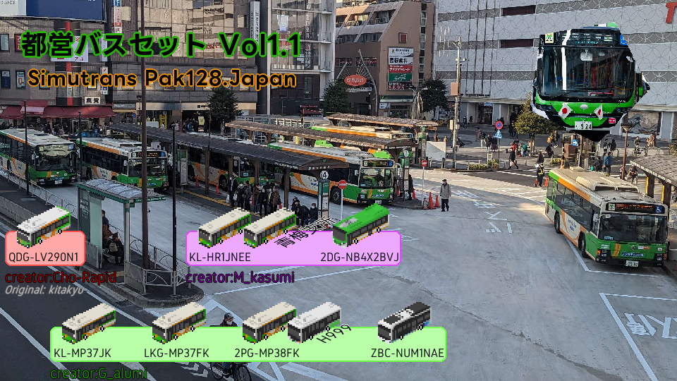
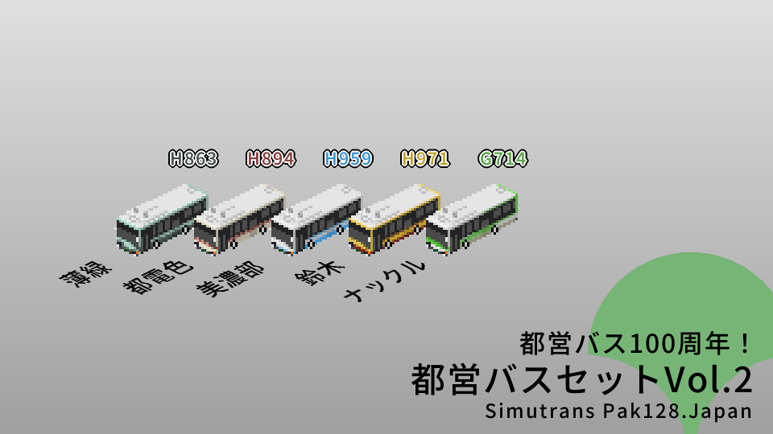

# 都営バスセット

Simutrans pak128.Japan
(Simutrans 123.0 and higher)

作者：G_alumi(あるみどり)/Cho-rapid(ちょーらぴっど)/M_kasumi

* 2024.01.20更新　Vol.2(100年セット)を追加
* 2023.11.19更新　スカニアフルノンステップバスを追加

NS用にバスをちょこちょこ塗ってたら結構そろったのである程度テーマを決めて公開します。
諸元に関してはわかる限りで合わせてあります。エンジン馬力が車種によって異なるのでギアである程度同じになるように調整してあります。
窓割は多分適当です。

エルガ(LV290)はきたきゅー氏のアドオンを改造させていただきました。その他車種もきたきゅー氏のアドオンに準じて作成しています。

G_alumiが取りまとめて公開しているので、何かあればG_alumi(twitter:[@G_alumi](http://twitter.com/G_alumi))にご連絡くださいませ。

